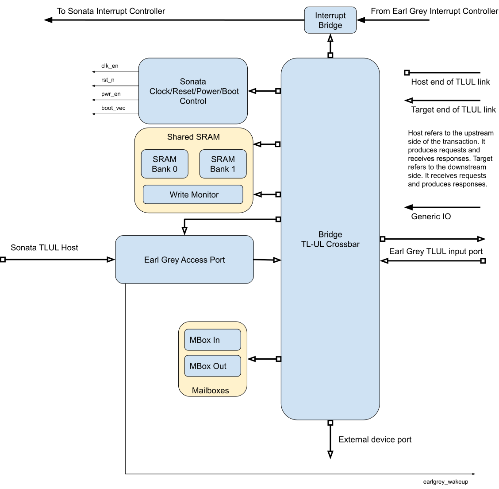

# Bridge Interface

The bridge interface enables the Sonata system to communicate with Earl Grey via Tile Link transactions.
It maintains a security boundary so all accesses into the Earl Grey Tile Link fabric are strictly controlled and the security properties of Earl Grey are not violated.
At its core the bridge interface is a Tile Link crossbar with a number of peripherals connected to it.
This crossbar is connected into the Earl Grey Tile Link fabric and is directly visible in the Ibex core address space.
The Sonata system has no direct access to the Tile Link crossbar or the bridge interface peripherals.

All transactions from the Sonata system go through the 'Earl Grey access port' which provides address translation services which are under the control of Earl Grey.
For details see [Earl Grey Access Port](earl_grey_access_port.md).

To enable communication between Sonata and Earl Grey a mailbox and two banks of SRAM are attached to the bridge interface crossbar.

## Bridge Interface Components

 * [Interrupt Bridge](interrupt_bridge.md) - Sends interrupts from Earl Grey to Sonata.
 * [Sonata System Control](sonata_system_control.md) - Gives control over Sonata clock, reset, power and boot to Earl Grey.
 * [Shared SRAM](shared_sram.md) - Two banks of SRAM that can be accessed in parallel along with a write monitor that can notify Earl Grey of writes to monitored locations.
 * [Mailbox](mailbox.md) - For passing small messages between Earl Grey and Sonata.
 * [Earl Grey Access Port](earl_grey_access_port.md) - Provides access to the Earl Grey Tile Link interconnect via an address translation and protection mechanism controlled by Earl Grey.
 * [Bridge Crossbar](bridge_crossbar.md) - Connects the bridge interface components together and provides a connection into the Earl Grey Tile Link fabric.
