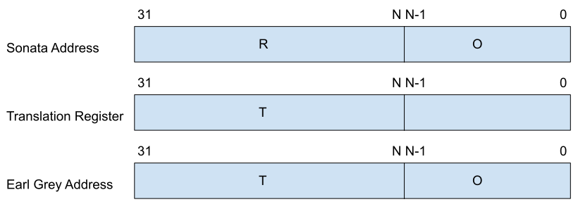

# Earl Grey Access Port

All Tile Link transactions from Sonata go through the access port.
It is the only way Sonata can access Earl Grey.
Transactions go through address translation and undergo permission checks.
Earl Grey controls the translations and permissions.
This means that access to Earl Grey is only provided to Sonata if the Earl Grey firmware permits it.

## Theory of operation

The access port is intended to be used in a similar way to demand paging.
When a transaction from Sonata is for an address that isn't currently mapped in the available address translation regions, Earl Grey receives an interrupt.
If the Earl Grey firmware wishes to allow the transaction, it can setup an appropriate mapping and instruct the access port to let it go through.
If it doesn't want to allow the transaction, it will instruct the access port to deny the transaction and produce a bus error.
On the Sonata side this happens transparently.
The transaction is held in the access port (where there's no existing matching address translation region) and only sends a response back to Sonata once Earl Grey has signaled whether or not the accept the transaction.
As this is handled by software in Earl Grey it introduces substantial latency whenever Sonata accesses a region the Earl Grey firmware allows it to access but is not currently mapped in.
To help ameliorate this multiple address translation regions are provided.
The Earl Grey firmware will aim to setup the regions so what it anticipates being the most regularly used and latency critical ones can be left mapped in using a subset for dynamic remapping as required.

Four address translation regions are provided.
Each region is controlled by two registers, a region register and a translation register.
The region register specifies the address region in the Sonata address map that will get translated.
Regions must all be power of two sized and naturally aligned.
The NAPOT (naturally aligned power of two) scheme used by PMP (Physical Memory Protection) in the RISC-V architecture is used to specify a region.
This is explained in the register definitions below.

Additionally there are three fixed regions that have immutable address however their access permissions are controlled by Earl Grey.
These are used to provide access to the two SRAM banks and the mailbox.
When accessing one of these fixed regions if access is disabled Earl Grey will receive an interrupt identically to accesses outside of the fixed regions that don't match a region.

The translation register specifies the base address to translate to in the Earl Grey address map along with permissions.
When an incoming memory transaction matches a region it is split into the region address (R) and the offset (O).
R is replaced with the translation address (T) leaving O untouched to produce the Earl Grey address.
This is illustrated below.
The bottom 3 bits of the translation register (which aren't needed for an address as the minimum region size is 8 bytes) provide read/write/execute permissions.

If an incoming Sonata transaction matches a region and passes permissions checks as described above it is passed through to Earl Grey.
If it does not match a region it is held in the access port (no response is returned initially) and an interrupt is signaled to Earl Grey.
The transaction remains held until Earl Grey releases it by writing to the decision register.
Whilst a transaction is held, the access port will not accept any other transactions.

Either the transaction is rejected or accepted.
An accepted transaction goes through the region matching and address translation again (exactly as if it was a fresh transaction).
When accepting a transaction, it is Earl Grey's responsibility to ensure an appropriate region has been setup to allow the transaction.
If this is not done correctly Earl Grey will receive another interrupt and the transaction will be held awaiting a decision once again.
A rejected transaction results in an error response being sent back to Sonata.

If a transaction matches a region but fails the permission checks it is immediately rejected with an error response sent back to Sonata.

Two registers, last error address and last error info are visible in the Sonata address map.
When an error response is seen from the access port by Sonata it can consult these registers to find the rejection reason.

The access port is visible in two separate places in the Sonata address space.
  1. The Earl Grey Access Region - A 1 GiB aligned region, all accesses here are sent to the access port for region matching, permission checks and translation.
  2. The Sonata Register Region - A small region for accessing the Sonata visible registers (see details below).

## Fixed Regions

The fixed regions are at a constant offset within the Earl Grey Access Region in the Sonata address space.
They translate to fixed addresses inside of the Earl Grey address space.

| Index | Block accessed | Size    | Earl Grey Access Region offset | Earl Grey base address |
| ----- | -------------- | ------- | ------------------------------ | ---------------------- |
| 0     | Mailbox        | 8 bytes | 0x3C000000                     |                        |
| 1     | SRAM Bank 0    | 4 kiB   | 0x3C001000                     |                        |
| 2     | SRAM Bank 1    | 4 kiB   | 0x3C002000                     |                        |

## Earl Grey Visible Registers

### Region

*Read-write*

There are 4 region registers (one for each supported region).
Both the base address and size of the region are encoded in the `region_addr` field using the same NAPOT encoding scheme used by PMP addresses in the RISC-V privileged architecture (see Table 3.11 in the privileged architecture version 20211203).
The minimum size of a region is 8 bytes, all region sizes must be a power of two and their base address aligned to their size.
The location of the first 0 in `region_addr` sets the size, where it occurs in bit position 0, it is an 8-byte region, in bit position 1 it is a 16-byte region and so on.
The remaining bits then provide the base address, this is illustrated in the table below for the first 3 region sizes.

| region_addr | Region Address and Size                              |
| ----------  | ---------------------------------------------------- |
| bbb...bbb0  | 8 byte region, starting at address 32'bbb...bbb000   |
| bbb...bb01  | 16 byte region, starting at address 32'bbb...bb0000  |
| bbb...b011  | 32 byte region, starting at address 32'bbb...b00000  |

For example a `region_addr` of 0x2000ffff encodes a region of size 512 kiB (first 0 in bit position 16, (2^16) * 8 == 512k),  with a base address of 0x80000000.

Where regions overlap and an incoming address matches multiple regions the one with the lowest index is chosen.

When matching an incoming transaction against a region the address if the full address, it is not effected by where the Earl Grey access region is situated in the Sonata address map.
For example if the Earl Grey access region is mapped into the 1 GiB region starting at 0x40000000 an transaction for address 0x40080000 will be matched against regions using that address unaltered, not the address 0x00080000 (the offset of the address within the access region).
Configured regions always take priority over the fixed regions.

### Translation

*Read-write*

There are 4 translation registers (one for each supported region).
The translation register provides the base address of the region an allowed transaction is mapped into.
Only the top `N` bits of `translation_addr` are relevant with `N` dependent on the size of the region.
Where the region is 8-bytes the top 29 bits are relevant, with 16-bytes the top 28 and so on.
When an access passes the permission checks the top `N` bits of the incoming Sonata address are replaced with `translation_addr` to produce the Earl Grey address.

The three permission bits `r`, `w` and `x` indicate whether read, write and execute are permitted in the region respectively.
All combinations of permission bits are allowed.
Where all three permission bits are cleared the region is disabled and ignored when matching incoming transactions to the region register.

The 3 fixed regions have Translation registers but only the permission bits are writable, the `translation_addr` field will ignore writes and return the fixed base address for the fixed region.

### Pending Transaction Address

*Read-only*, writes are ignored.

When a transaction is being held by the access port this register gives its address (in Sonata address space).
It is guaranteed the value in this register remains constant when `valid` is set in the Pending Transaction Access Register until a write to the Decision Register occurs.

### Pending Transaction Access

*Read-only*, writes are ignored.

When a transaction is being held by the access port this register provide information about what it wants to do.
`valid` indicates there is a transaction being held.
One of `r`, `w` or `x` will be set when `valid` is set, indicating the transaction is a read, a write or an execute access respectively.
It is guaranteed the value in this register remains constant when `valid` is set until a write to the Decision Register occurs.

### Decision

*Write-only*, reads always return 0.

When a transaction is being held by the access port writing to this register tells the access port what to do with it.
Either it is accepted or rejected.
If accepted the access is replayed against the region matching (it is the software's responsibility to setup the region and translation registers such that an accepted access will pass).
If rejected the transaction is dropped by the access port and an error response sent in return to Sonata.

Writing the following values to `cmd` will either accept or reject the transaction.
A write of another value or a write whilst there is no pending transaction (`valid` in the Pending Transaction Access Register is unset) has no effect.

| `cmd`   | Action |
| ------- | ------ |
| 0x78    | Accept |
| 0xF6    | Reject |

These values have been chosen so they have a Hamming distance of 4 between them and also aren't a simple inversion of one another.

## Sonata Visible Registers

### Last Error Address

*Read-only*, writes are ignored.

When a transaction has produced an error response the address of that transaction is held in this register.
It is guaranteed to remain constant until the next transaction enters the access port.

### Last Error Info

*Read-only*, writes are ignored.

When a transaction has produced an error response this register provides additional information about that error.

`r`, `w`, and `x` indicate if the transaction tried to perform a read, write or execute access respectively.

`status` indicates the status of the last transaction, it can take one of the following values:

| `status` | Meaning                                                        |
| -------- | -------------------------------------------------------------- |
| 0x0      | No error                                                       |
| 0x1      | Permission error (matched region, failed permission check)     |
| 0x2      | Rejected (didn't match region, Earl Grey rejected transaction) |

The value of this register is guaranteed to remain constant until the next transaction enters the access port.

## Register Offsets

### Earl Grey Visible Registers

| Offset | Register                          |
| ------ | --------------------------------- |
| 0x0    | Region 0                          |
| 0x4    | Region 1                          |
| 0x8    | Region 2                          |
| 0xc    | Region 3                          |
| 0x100  | Translation  0                    |
| 0x104  | Translation  1                    |
| 0x108  | Translation  2                    |
| 0x10c  | Translation  3                    |
| 0x1f4  | Fixed Translation 2 (SRAM Bank 1) |
| 0x1f8  | Fixed Translation 1 (SRAM Bank 0) |
| 0x1fc  | Fixed Translation 0 (Mailbox)     |
| 0x200  | Pending Transaction Address       |
| 0x204  | Pending Transaction Access        |
| 0x208  | Decision                          |

### Sonata Visible Registers

| Offset | Register           |
| ------ | --------           |
| 0x0    | Last Error Address |
| 0x4    | Last Error Info    |
